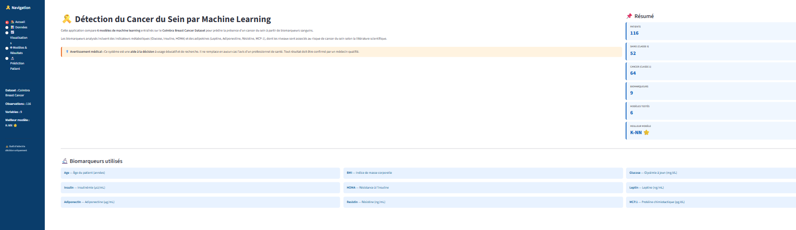
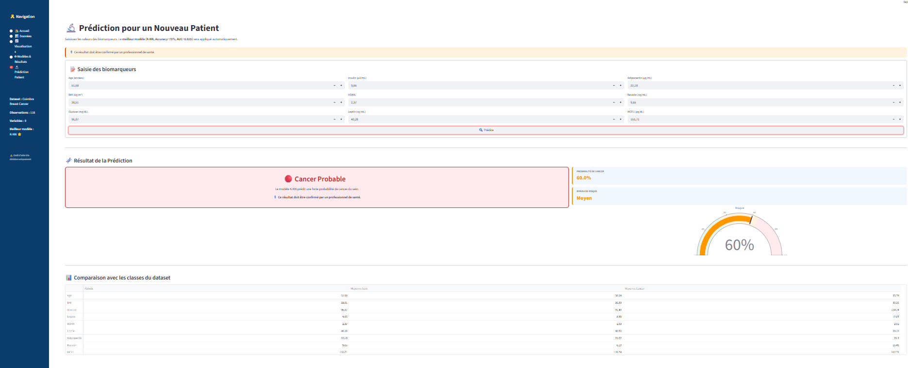
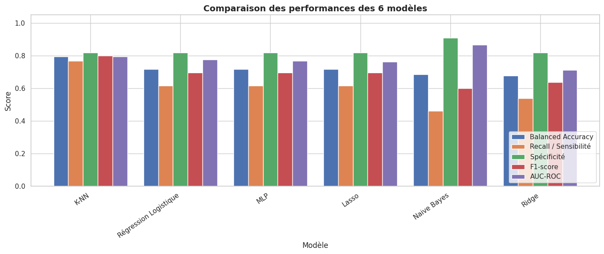
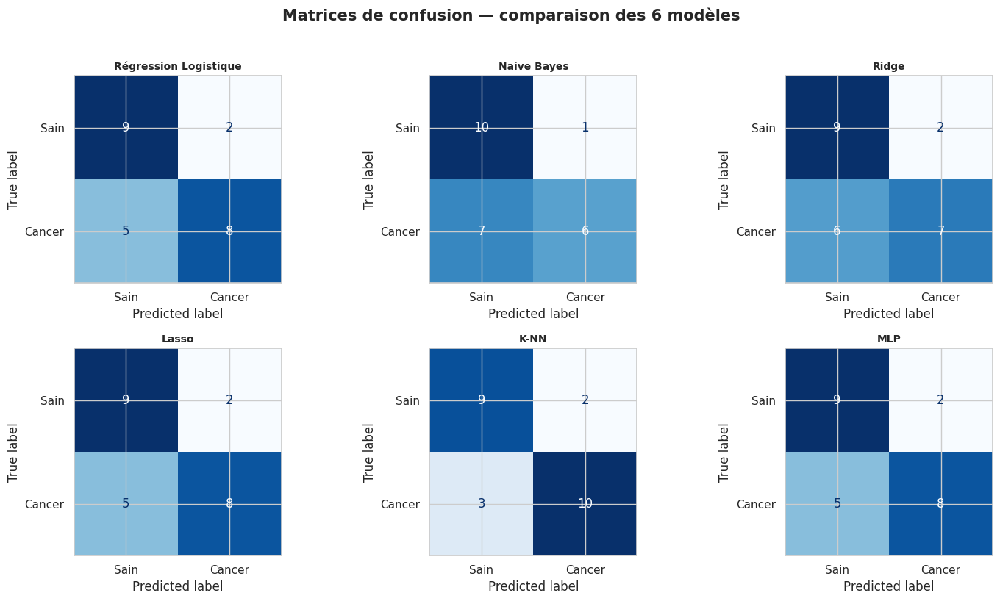
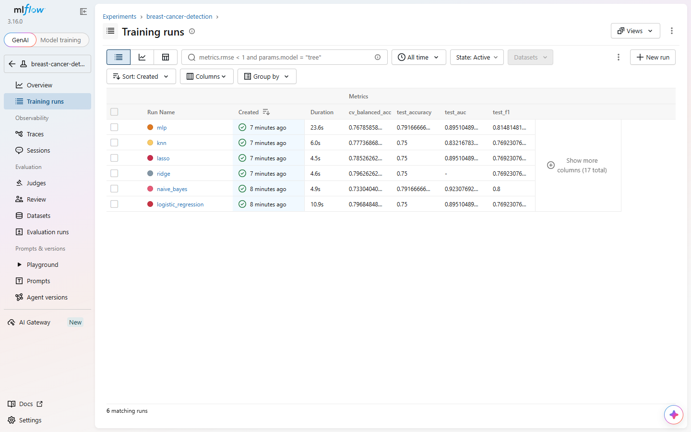

# Breast Cancer Prediction — Machine Learning & MLOps

A complete Machine Learning project for **breast cancer prediction from clinical and blood biomarker data**, including exploratory analysis, model comparison, a Streamlit application, experiment tracking with MLflow, automated testing, Docker containerization, CI/CD, and data-drift monitoring with Evidently.

> **Medical disclaimer:** This project is intended for academic, educational, and research purposes only. It is a decision-support prototype and **must not be used as a medical diagnostic tool**. Any result must be interpreted and confirmed by qualified healthcare professionals.

---

## Project Date

**May 2026**

---

## Overview

This project investigates whether supervised Machine Learning models can help distinguish between healthy patients and patients diagnosed with breast cancer using biomedical variables.

The repository covers the full workflow:

- Data exploration and preprocessing
- Feature analysis and visualization
- Training and comparison of multiple classification models
- Hyperparameter tuning
- Evaluation with medically relevant metrics
- Selection of a final model
- Interactive prediction through Streamlit
- MLflow experiment tracking
- Model rollback
- Docker containerization
- GitHub Actions CI/CD
- Prediction logging
- Data-drift monitoring with Evidently

The final application is designed as an **educational decision-support interface**, not as a replacement for clinical screening or diagnosis.

---

## Research Question

> Can Machine Learning techniques help distinguish breast cancer cases from healthy cases using blood biomarkers and clinical data?

---

## Dataset

The project uses the **Coimbra Breast Cancer Dataset**.

### Dataset Summary

- **Observations:** 116
- **Predictive variables:** 9
- **Target:** `Classification`
- **Class 0:** Healthy
- **Class 1:** Breast cancer

### Features

| Feature | Description |
|---|---|
| `Age` | Patient age |
| `BMI` | Body Mass Index |
| `Glucose` | Fasting blood glucose |
| `Insulin` | Blood insulin level |
| `HOMA` | Homeostatic Model Assessment |
| `Leptin` | Leptin biomarker |
| `Adiponectin` | Adiponectin biomarker |
| `Resistin` | Resistin biomarker |
| `MCP.1` | Monocyte Chemoattractant Protein-1 |

The application contains **52 healthy observations** and **64 breast-cancer observations** after target recoding.

---

## Machine Learning Workflow

```text
Raw Dataset
    ↓
Target Recoding
    ↓
Exploratory Data Analysis
    ↓
Train / Test Split
    ↓
Feature Standardization
    ↓
Model Pipelines
    ↓
GridSearchCV
    ↓
Medical Metric Evaluation
    ↓
Model Comparison
    ↓
K-NN Selection
    ↓
Saved sklearn Pipeline
    ↓
Streamlit Application
```

The saved production artifact is:

```text
models/pipeline.pkl
```

It contains both preprocessing and the trained model in a single scikit-learn `Pipeline`, reducing the risk of using a model with an incompatible scaler.

---

## Models Compared

Six supervised classification approaches are compared:

| Model | Role |
|---|---|
| Logistic Regression | Interpretable linear baseline |
| Naive Bayes | Probabilistic classifier |
| Ridge Classifier | Regularized linear classification |
| Lasso-based classifier | Sparse / feature-selection-oriented approach |
| K-Nearest Neighbors | Local similarity-based classification |
| MLP Classifier | Neural-network approach |

A `DummyClassifier` is also used as a naive baseline.

---

## Evaluation Metrics

Because this is a medical classification problem, the project does not rely on accuracy alone.

The evaluation includes:

- Accuracy
- Balanced Accuracy
- Recall / Sensitivity
- Specificity
- Precision
- F1-score
- AUC-ROC
- False Negatives
- False Positives
- Matthews Correlation Coefficient

Particular attention is given to **false negatives**, because missing a positive case is especially important in a medical screening context.

---

## Selected Model

The project selects **K-Nearest Neighbors (K-NN)** as the final model because it provides the preferred compromise between classification performance and error balance in the current workflow.

The current Streamlit comparison table reports for K-NN:

| Metric | Value |
|---|---:|
| Accuracy | 75.00% |
| Precision | 76.92% |
| Recall / Sensitivity | 76.92% |
| F1-score | 76.92% |
| AUC-ROC | 0.8252 |
| False Negatives | 3 |
| False Positives | 3 |

> Results are based on a small dataset and should be interpreted cautiously.

---

## Streamlit Application

The project includes an interactive Streamlit application with six main sections:

```text
🏠 Home
📊 Data
📈 Visualizations
🤖 Models & Results
🔬 Patient Prediction
🩺 Monitoring
```

### Main Capabilities

- Dataset overview
- Descriptive statistics
- Target-class distribution
- Biomarker distributions
- Correlation matrix
- Boxplots by class
- Six-model comparison
- Patient biomarker input form
- K-NN prediction
- Prediction probability
- Risk gauge
- Comparison with healthy/cancer group averages
- Production prediction logging
- Data-drift monitoring

---

## Screenshots

### Streamlit Application



### Prediction Result



### Model Comparison



### Model Evaluation



### MLflow Training Runs



---

## Project Structure

```text
breast-cancer-ml-prediction/
│
├── README.md
├── requirements.txt
├── .gitignore
├── .dockerignore
├── Dockerfile
├── restore_run.py
│
├── .github/
│   └── workflows/
│       └── ci-cd.yml
│
├── app/
│   └── app.py
│
├── train/
│   └── train_model.py
│
├── monitoring/
│   ├── __init__.py
│   ├── logger.py
│   ├── drift_report.py
│   ├── reference_data.csv
│   └── predictions_log.csv        # generated at runtime
│
├── tests/
│   └── test_model.py
│
├── data/
│   └── dataR2.csv
│
├── models/
│   └── pipeline.pkl
│
├── notebooks/
│   └── breast_cancer_modeling.ipynb.ipynb
│
├── reports/
│   ├── breast_cancer_report.pdf
│   └── breast_cancer_presentation.pdf
│
└── images/
    ├── streamlit_app.png
    ├── prediction_result.png
    ├── model_comparison.png
    ├── model_evaluation.png
    └── mlflow_training_runs.png
```

---

# Installation

## 1. Clone the Repository

```bash
git clone https://github.com/arefbakali/breast-cancer-ml-prediction.git
cd breast-cancer-ml-prediction
```

## 2. Create a Virtual Environment

```bash
python -m venv .venv
```

### Windows

```powershell
.\.venv\Scripts\Activate.ps1
```

or with Command Prompt:

```bat
.venv\Scripts\activate
```

### macOS / Linux

```bash
source .venv/bin/activate
```

## 3. Install Dependencies

```bash
pip install -r requirements.txt
```

## 4. Run the Streamlit Application

```bash
streamlit run app/app.py
```

Then open:

```text
http://localhost:8501
```

---

# MLOps Workflow

The project includes a lightweight end-to-end MLOps layer.

```text
Training
   ↓
MLflow Tracking
   ↓
Saved sklearn Pipeline
   ↓
Automated Tests
   ↓
Docker Build
   ↓
Streamlit Inference
   ↓
Prediction Logging
   ↓
Evidently Drift Monitoring
```

---

## MLflow Experiment Tracking

Retrain and log the six model experiments with:

```bash
python train/train_model.py
```

The training workflow logs:

- Hyperparameters
- Accuracy
- Precision
- Recall
- F1-score
- AUC
- False negatives
- False positives
- Confusion matrix
- ROC curve
- Fitted model pipeline
- Input / output signature

Start the MLflow interface with:

```bash
mlflow ui --backend-store-uri ./mlruns
```

Then open:

```text
http://localhost:5000
```

MLflow tracking data is stored locally in:

```text
mlruns/
```

and is intentionally excluded from Git.

---

## Model Rollback

A previous MLflow run can be restored with:

```bash
python restore_run.py <run_id>
```

The script loads the model artifact from that MLflow run and overwrites:

```text
models/pipeline.pkl
```

This provides a simple rollback mechanism without requiring a model registry.

---

## Prediction Logging

Each prediction produced by the Streamlit patient-prediction page can be logged to:

```text
monitoring/predictions_log.csv
```

The log contains:

- Timestamp
- Patient feature values
- Predicted class
- Prediction probability

This runtime file is excluded from Git.

---

## Data Drift Monitoring

The project uses **Evidently** to compare production inputs against the training-data reference distribution.

Reference data:

```text
monitoring/reference_data.csv
```

Production prediction log:

```text
monitoring/predictions_log.csv
```

Generate the drift report with:

```bash
python monitoring/drift_report.py
```

The generated report is written to:

```text
monitoring/reports/data_drift_report.html
```

The Streamlit **Monitoring** page can also generate and display the Evidently report directly.

At least **10 logged predictions** are required before the project considers the drift report statistically useful.

---

# Testing

Run the automated tests with:

```bash
pytest tests/
```

The tests verify that:

- `models/pipeline.pkl` loads correctly
- The pipeline exposes a prediction interface
- Test accuracy remains above the configured minimum threshold
- Predicted classes remain valid
- Single-patient prediction works
- Prediction logging works correctly

The current regression guard uses:

```text
Minimum acceptable accuracy: 0.60
```

---

# Code Quality

Run Flake8 locally with:

```bash
flake8 .
```

The GitHub Actions workflow treats syntax errors and undefined names as blocking errors while reporting general style issues separately.

---

# CI/CD — GitHub Actions

The workflow is defined in:

```text
.github/workflows/ci-cd.yml
```

It runs on:

- Pushes to `main`
- Pull requests targeting `main`

Pipeline:

```text
Lint
  ↓
Tests
  ↓
Docker Build
```

### CI Jobs

1. **Lint**
   - Python 3.11
   - Flake8
   - Blocking checks for real code errors

2. **Test**
   - Installs `requirements.txt`
   - Runs `pytest tests/`

3. **Build**
   - Builds the Docker image
   - Verifies that the project can be packaged successfully

Registry publishing is intentionally left configurable because deployment credentials depend on the chosen platform.

---

# Docker

## Build the Image

```bash
docker build -t breast-cancer-ml-prediction .
```

## Run the Container

```bash
docker run -p 8501:8501 breast-cancer-ml-prediction
```

Open:

```text
http://localhost:8501
```

The Docker image uses:

```text
python:3.10-slim
```

and exposes Streamlit on port:

```text
8501
```

A Docker health check verifies:

```text
http://localhost:8501/_stcore/health
```

---

## Main Dependencies

### Machine Learning & Data

- Python
- Pandas
- NumPy
- Scikit-learn
- Joblib
- OpenPyXL

### Visualization

- Plotly
- Matplotlib
- Seaborn

### Application

- Streamlit

### MLOps

- MLflow
- Evidently
- Docker
- GitHub Actions

### Quality

- pytest
- Flake8

---

## Reproducibility

The project uses:

```text
RANDOM_STATE = 42
```

for the train/test split and model workflows where applicable.

The test split is stratified to preserve class proportions.

---

## Key Takeaways

- Medical classification requires metrics beyond accuracy.
- K-NN is the selected production model in the current project.
- A single scikit-learn pipeline keeps preprocessing and inference synchronized.
- MLflow makes experiment comparison and rollback easier.
- Automated tests provide a basic guard against silent model regression.
- Evidently provides visibility into production data drift.
- Docker makes the Streamlit application portable.
- GitHub Actions validates code quality, tests, and container builds automatically.
- The small dataset remains the primary limitation of the experiment.

---

## Limitations

- The dataset contains only **116 observations**.
- Results may vary substantially with different splits or validation strategies.
- The model has not undergone prospective clinical validation.
- The application is not a certified medical device.
- The model should not be used for diagnosis or treatment decisions.
- Drift monitoring identifies changes in input distributions but does not by itself prove a loss of clinical performance.
- A real production medical system would require substantially stronger security, validation, governance, privacy, and regulatory controls.

---

## Future Improvements

- Validate on a larger external dataset
- Add repeated or nested cross-validation
- Add model explainability with SHAP or LIME
- Add calibration analysis for predicted probabilities
- Add automated model-performance monitoring when labels become available
- Trigger retraining workflows after validated drift conditions
- Push Docker images to GHCR or Docker Hub
- Add cloud deployment
- Add model-card documentation
- Expand CI/CD with security and dependency checks
- Add more robust production logging and observability

---

## Medical Disclaimer

This repository is an academic Machine Learning project.

The prediction displayed by the application:

- is **not a diagnosis**
- does **not replace mammography, imaging, laboratory assessment, or clinical evaluation**
- does **not replace a physician**
- should **not be used to make treatment decisions**

If there is a medical concern, a qualified healthcare professional should be consulted.

---

## Contact

- **GitHub:** https://github.com/arefbakali
- **LinkedIn:** https://www.linkedin.com/in/aref-bak-ali/
- **Email:** aref.bak-ali@dauphine.eu
- **Portfolio:** https://portfolio-aref.vercel.app/

## Contact

- **GitHub:** https://github.com/arefbakali
- **LinkedIn:** https://www.linkedin.com/in/aref-bak-ali/
- **Email:** aref.bak-ali@dauphine.eu
- **Portfolio:** https://portfolio-aref.vercel.app/

## Author

**Aref Bak Ali**  
AI, Data Science & Agentic AI Student  
Université Paris Dauphine-PSL
